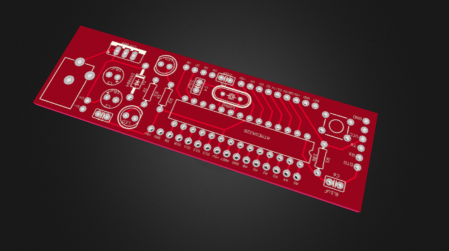

# uDuino
Arduino compatible AVR Development Board

#### Top Layer

#### Bottom Layer

#### 3D View
<a href="https://sketchfab.com/models/0a4b825f3d744794a45e6b6fafa52535">

</a>

---
#### Want to order the board

## License
[Creative Commons Attribution Share Alike 4.0](https://creativecommons.org/licenses/by-sa/4.0/)
